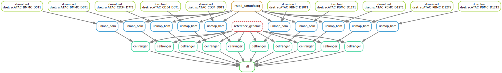

# MPAL-hg38

This repository contains code used to re-process the healthy CD34+, bone marrow, and PBMC cell
samples generated by Granja et al. (2019), using the hg38 genome. The original
publication mapped reads to hg19.

Paper: https://www.nature.com/articles/s41587-019-0332-7  
GitHub: https://github.com/GreenleafLab/MPAL-Single-Cell-2019  
GEO: https://www.ncbi.nlm.nih.gov/geo/query/acc.cgi?acc=GSE139369  
SRA: https://www.ncbi.nlm.nih.gov/sra?term=SRP226885  

## Instructions

The data required is stored on Google Cloud (at the SRA), and the data egress is
**not free**. To download the raw data, you will need to set up an GCP account
and configure `gcloud` to use your account by running `gcloud init`.

The workflow also requires cellranger-atac v2, which needs to be installed from
the 10x Genomics website first (there's no programmatic way to install
currently): https://support.10xgenomics.com/single-cell-atac/software/downloads/latest 

The workflow requires snakemake, so if you don't have snakemake
installed you can create a new conda environment with snakemake using the
following command:

```
mamba env create -f environment.yaml
conda activate mpal
```

Run the snakemake workflow:

```
snakemake -j 1
```

This will download the hg38 cellranger reference genome and the raw
data from SRA (as BAM files). Raw data will be converted back to FASTQ using
the `bamtofastq` program, then mapped to hg38. The final output will be
the cellranger-atac output for each sample.


